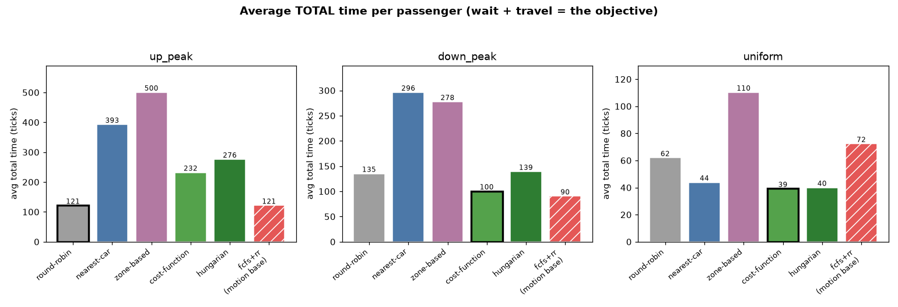

# Elevator System Simulation

A discrete-time simulation of a multi-elevator **Destination Dispatch** system. Passengers
submit an origin and destination; a scheduler assigns each to an elevator; the simulation
ticks forward one floor at a time and reports how well every passenger was served.

The design treats this as what it really is — an **online, capacity-constrained dispatch
problem** (the same shape as load-balancing requests across a worker pool) — and separates
the two decisions cleanly:

- **Motion** — how one car sequences its own stops (fixed at **LOOK**).
- **Dispatch** — which car serves a new request (five policies, compared).

---

## Quick start

```bash
python -m venv .venv
# Windows:  .venv\Scripts\activate       (or use .venv\Scripts\python.exe directly)
# macOS/Linux:  source .venv/bin/activate
pip install -r requirements.txt

# run a single simulation (generates an office-building trace, plots the result)
python -m elevator_sim --generate --dispatch cost_function --plot

# run against your own trace file (CSV: time,id,source,dest)
python -m elevator_sim --input your_trace.csv --floors 60 --dispatch nearest_car

# reproduce the 18 demo runs (6 schedulers x 3 patterns)
python run_demo.py

# run the correctness tests
python tests/test_correctness.py        # or: python -m pytest tests/
```

Requires Python 3.10+ and `numpy`, `scipy`, `pandas`, `matplotlib` (see `requirements.txt`).

---

## Usage

`python -m elevator_sim [options]` runs one simulation and writes outputs to `--output` (default `outputs/run/`).

| Option | Default | Meaning |
|---|---|---|
| `--input FILE` | — | load a trace CSV (`time,id,source,dest`) |
| `--generate` | — | generate a synthetic trace instead |
| `--pattern` | `up_peak` | `up_peak` / `down_peak` / `uniform` (for `--generate`) |
| `--lambda` | `3` | arrivals per tick |
| `--duration` | `900` | arrival window in ticks |
| `--seed` | `42` | RNG seed (reproducible) |
| `--elevators` / `--floors` | `16` / `25` | building size |
| `--capacity` / `--dwell` | `10` / `2` | car capacity / door-dwell ticks per stop |
| `--motion` | `look` | `look` / `fcfs` |
| `--dispatch` | `cost_function` | `round_robin` / `nearest_car` / `zone_based` / `cost_function` / `hungarian` |
| `--aging` | `0.1` | anti-starvation weight (`0` = off) |
| `--w-dist/--w-dir/--w-load/--w-eta` | `1 / 2 / 0.5 / 1.5` | cost-function weights |
| `--plot` | — | render `distributions.png` |

**Outputs per run:** `positions_log.csv` (one row per tick), `passengers.csv` (one row per
passenger), `summary_stats.json` (aggregate metrics), and a console summary table.

---

## The model

- **Discrete-time**: one tick = one floor of travel; the sim advances one tick at a time and
  never peeks ahead at future requests.
- **Destination Dispatch**: each request carries origin + destination; the controller assigns it
  to a specific car immediately, and the assignment is irrevocable.
- **Configurable**: number of elevators, floors, and capacity per car.

### Dispatch policies

| Policy | Idea |
|---|---|
| **Round-robin** | assign to cars in strict rotation — ignores position (naive baseline) |
| **Nearest-car** | classic ~1970s "Figure of Suitability" heuristic (close + right direction) |
| **Zone-based** | split the building into banks; a request goes to its zone's nearest car |
| **Cost-function** | score each car by `distance + direction + load + ETA`; take the cheapest |
| **Hungarian** | optimal batch assignment (`scipy`) — the benchmark the greedy policies chase |

All dispatch policies balance against each car's **committed load** (onboard + assigned-and-
waiting) so a burst of arrivals spreads instead of dogpiling one car. **Motion** is LOOK (an
FCFS-motion baseline is included to show the gap).

### Metrics

Per passenger: **wait**, **travel**, **total** time. Aggregate: min/max/avg + **p90/p95** wait
(the fairness tail), utilization **ρ**, throughput, and pooling measures **distance-per-passenger**
and **passengers-per-stop**.

---

## Observations

From the 18 demo runs (`python run_demo.py`, office defaults, λ=3, seed 42) — **average total
time** per passenger (`wait + travel`, the objective). Best **dispatch** policy per pattern in
**bold**; `fcfs+rr` is the *motion* baseline (a different question, shown for reference).
*(Illustrative single-seed runs; a rigorous replicated study with error bars is planned — see
"What I'd improve".)*

| Pattern | round-robin | nearest-car | zone | cost-fn | hungarian | fcfs+rr* |
|---|---|---|---|---|---|---|
| **up_peak** | **121** | 393 | 500 | 232 | 276 | 121 |
| **down_peak** | 135 | 296 | 278 | **100** | 139 | 90* |
| **uniform** | 62 | 44 | 110 | **39** | 40 | 72 |



**The headline finding: the best dispatch policy depends on whether *pickup floors* are
concentrated or spread out.** Dispatch decides *which car serves a pickup*, so what matters is
*where the pickups are*:

- **`up_peak` — every pickup is at the lobby → round-robin is near-optimal.** All 16 cars sit at
  the lobby, so position can't tell them apart; round-robin's blind even-spread keeps every car
  busy (ρ ≈ 0.96) while the position-aware policies over-think it and leave cars idle (ρ down to
  0.28–0.72). This is the **only** pattern where the naive baseline wins.
- **`down_peak` & `uniform` — pickups are spread across floors → cost-function / Hungarian win.**
  When pickup floors differ, position + ETA awareness pays off: cost-function serves ~1.6× faster
  on total time in interfloor (and **~3× faster on *wait***), and it also beats round-robin on
  down_peak.
- **Zone-based is consistently worst** — it fragments the fungible fleet (ρ 0.28–0.56): a busy
  bank's cars overload while another bank idles.

This mirrors a well-known result in elevator control: sophisticated dispatch shines whenever
origin floors vary, while the one truly uniform-origin case (morning up-peak) rewards simplicity.

\*The FCFS *motion* baseline edges out every LOOK dispatch policy on down_peak (total 90) — a real
but subtle quirk: down_peak's destinations are all the lobby, so there's no drop-off order for
LOOK to optimize, and FCFS's oldest-first *pickup* order cuts wait. It answers "does motion
matter?", not "which dispatch is best?", so it's set apart (hatched in the chart).

Two bugs surfaced immediately when all policies were run on the same trace, and both are worth
noting as things testing caught: a **concentration bug** (the load term ignored not-yet-boarded
riders, so one car attracted 500+ passengers — fixed with committed-load balancing) and an
**FCFS deadlock** (a full car chased un-boardable pickups forever — fixed with a capacity guard).

---

## Assumptions & simplifications

- **Constant speed, 1 floor/tick, no acceleration/deceleration.** Door **dwell** is a flat cost
  per stop (default 2 ticks), one per stop rather than per passenger.
- **Immediate, irrevocable assignment** (matching the prompt) — a car assignment is never changed
  once made. A bumped (over-capacity) passenger keeps their original wait clock and boards on the
  car's next pass; there is no re-dispatch.
- **Fungible fleet** — all cars serve all floors (no express/zoned hardware; zone-based imposes
  zoning in software).
- **Trace-driven, no peek-ahead** — the scheduler only ever sees requests that have already
  arrived. Synthetic loads use a Poisson arrival process with an origin-destination pattern.
- **Input is lenient** — malformed rows are skipped with a warning (not fatal), so one bad line
  can't sink a run.

---

## What I'd improve with more time

- **Re-dispatch / working aging.** Under immediate + irrevocable assignment, anti-starvation
  aging has almost no leverage (there's no wait to act on at dispatch time). Allowing a
  long-waiting passenger to be *re-assigned* to a fresher car would give aging real teeth and
  directly fix the smart policies' peak-traffic under-utilization.
- **Adaptive batching / peak-mode dispatch.** Deliberately pooling more riders per car in peak
  traffic (the "up-peak mode" real systems use) would let the smart policies match or beat
  round-robin there.
- **Weight tuning.** The cost-function weights are hand-set; a grid search on the metrics would
  tune them per traffic pattern.
- **A rigorous, replicated study + dashboard.** The observations here are single-seed. The next
  step is a parameter sweep (λ × pattern × policy × many seeds, common random numbers) with
  mean ± error bars, surfaced in an interactive dashboard.

---

## Testing

`python tests/test_correctness.py` — deterministic cases with known outcomes, each run against
all five dispatch policies and both motion policies: every passenger delivered with consistent
timing, same-direction pooling, opposite-direction handling, capacity overflow, loader edge
cases, round-robin rotation, and nearest-car proximity.

---

## Project structure

```
elevator_sim/
  models.py        # Request / Passenger / Elevator (pure data)
  engine.py        # the discrete-time tick loop
  config.py        # SystemConfig, CostWeights
  motion/          # LOOK, FCFS  (Axis 1: how a car moves)
  dispatch/        # round_robin, nearest_car, zone_based, cost_function, hungarian, aging
  metrics.py       # compute stats (no I/O, no plotting)
  plots.py         # histogram rendering (matplotlib lives only here)
  io/              # trace_loader, generator, CSV/JSON writers
  cli.py           # single-run command line
run_demo.py        # reproduce the 18 demo runs
tests/             # correctness tests
```

The core (engine + policies + metrics) is I/O-agnostic; the `io/` writers are adapters, so
outputs can later be redirected (e.g. to a database) without touching the simulation.

---

## Time spent

~20–25 hours (problem framing & design, implementation, testing, and this write-up).
